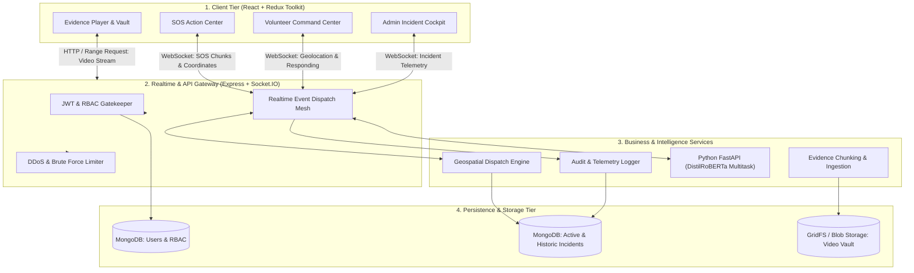

# 🛡️ SafeCircle 2.0 — Production Engineering Specification & Execution Blueprint

---

## 📌 Document Overview
This document defines the **Production-Readiness Architecture, Execution Roadmap, and Engineering Standards** for **SafeCircle 2.0**. It serves as the single source of truth for transitioning the project from prototype to enterprise-grade production.

---

## 🏗️ Production Engineering Principles
Every module implemented must adhere to the following 5 criteria:

1. **Deterministic Error Handling**: No uncaught promise rejections or unhandled socket exceptions. Every failure returns structured, typed error codes.
2. **State Resilience (Offline/Reconnect Grace)**: Network hiccups, page reloads, or device screen-locks must never orphan an active emergency or drop a responding volunteer.
3. **Data Integrity & RBAC**: Strict separation of concerns between `victim`, `volunteer`, and `admin` roles, verified at the API Gateway and Socket handshake layers.
4. **Binary & Media Scalability**: Video and audio evidence must not block Node event loops or cause memory leaks in MongoDB.
5. **Observability & Auditability**: Every critical event (SOS trigger, volunteer dispatch, role change, evidence access) must generate an immutable audit log.

---

## 🗺️ Master Flow Architecture



---

## 📋 Module-by-Module Technical Specification & Execution Order

```
[Module 1: Auth & Security Foundation] ──► [Module 2: Real-time SOS Engine] ──► [Module 3: Volunteer Dispatch]
                                                                                        │
[Module 6: Monitoring & Deployments]  ◄── [Module 5: Evidence & GridFS]   ◄── [Module 4: Admin & Audit]
```

---

### 🔹 Module 1: Authentication, Security & Session Resilience (PRIORITY: P0)
> **Goal:** Secure all entry points, prevent unauthorized access, and handle token lifecycles transparently.

#### Current State vs. Production Target
* **Current:** Basic JWT in localStorage; missing input validation schemas; no brute-force prevention on password verification.
* **Target:** 
  - Token refresh strategy with secure token validation.
  - Rate limiting on sensitive endpoints (Login, Register, Password Verification).
  - Validation middleware for all incoming request bodies.
  - Sanitization of user input to prevent NoSQL injection / XSS.

#### Detailed Task Breakdown
- [ ] **Task 1.1:** Implement request validation middleware for Auth routes (Register, Login, UpdateProfile).
- [ ] **Task 1.2:** Add `express-rate-limit` on `/api/auth/login` and `/api/auth/verify-password` (prevent brute-force).
- [ ] **Task 1.3:** Enhance session handling and user profile caching in Redux with persistence validation.
- [ ] **Task 1.4:** Standardize API responses into a unified JSON format: `{ success: boolean, data?: any, error?: { code: string, message: string } }`.

---

### 🔹 Module 2: Real-Time SOS Engine & Failover Pipeline (PRIORITY: P0)
> **Goal:** Zero-loss emergency broadcast pipeline with automatic reconnection, speech-to-text queuing, and AI evaluation.

#### Current State vs. Production Target
* **Current:** Browser captures audio and sends Base64 over single socket event; if socket disconnects, emergency state in frontend can get out of sync.
* **Target:**
  - Socket reconnection handshake that restores ongoing incident context upon reconnect.
  - Emergency Incident Schema in Database (persisting active emergencies, not just in-memory socket state).
  - WebRTC / MediaRecorder error fallbacks (e.g. if microphone permission denied, fallback to silent SOS).

#### Detailed Task Breakdown
- [ ] **Task 2.1:** Create `Incident` MongoDB model (`victimId`, `status: active|resolved`, `locationHistory: []`, `severity`, `logs: []`).
- [ ] **Task 2.2:** Update Socket.IO server to write incident state to MongoDB upon `victim-sos`.
- [ ] **Task 2.3:** Implement Socket heartbeat & reconnection sync: when client reconnects, server re-emits current incident state.
- [ ] **Task 2.4:** Safe cancellation workflow: Verify password -> update DB incident to `resolved` -> broadcast `admin-emergency-ended` & `volunteer-emergency-ended`.

---

### 🔹 Module 3: Volunteer Dispatch, Geofencing & Mission Sync (PRIORITY: P1)
> **Goal:** Intelligent nearest-neighbor dispatch, mission state preservation, and turn-by-turn route tracking.

#### Current State vs. Production Target
* **Current:** Dispatches to all online volunteers without distance-based filtering caps; route draws once.
* **Target:**
  - Configurable Geofence (e.g., alert volunteers within 5km radius first, expand to 10km after 30s if unaccepted).
  - Concurrency Lock: When a volunteer accepts, lock the mission so multiple volunteers don't clash unless configured for multi-responder.
  - Live Turn-by-Turn tracking with route recalculation when victim moves > 50m.

#### Detailed Task Breakdown
- [ ] **Task 3.1:** Implement server-side geospatial query or Haversine filter with tiered radius (Tier 1: 3km, Tier 2: 7km).
- [ ] **Task 3.2:** Add mission claim lock (`incident.assignedVolunteer = volunteerId`) to prevent race conditions.
- [ ] **Task 3.3:** Volunteer heartbeat system: auto-mark volunteer as OFFLINE if socket drops for > 30 seconds.
- [ ] **Task 3.4:** Volunteer navigation UI: ETA indicator, dynamic distance calculation, and emergency speed dial.

---

### 🔹 Module 4: Admin Command Center & Audit Telemetry (PRIORITY: P2)
> **Goal:** Full visibility of real-time incidents, volunteer fleet monitoring, and RBAC governance.

#### Current State vs. Production Target
* **Current:** Admin sees active alerts and user list; basic role change.
* **Target:**
  - Real-time situational dashboard with interactive Leaflet clustering for high volunteer density.
  - Historical Incident Explorer with playback of events, routes, and NLP severity timeline.
  - Volunteer Application Approval Workflow with document verification flags.

#### Detailed Task Breakdown
- [ ] **Task 4.1:** Build historical Incident Explorer with pagination, date filters, and status filters.
- [ ] **Task 4.2:** Add detailed audit trail: who triggered, which volunteers were notified, response times, and resolution notes.
- [ ] **Task 4.3:** Admin role management: Promote/demote users with confirmation modals and permission safeguards (prevent self-demotion).

---

### 🔹 Module 5: Evidence Vault & Large Binary Optimization (PRIORITY: P2)
> **Goal:** Secure, fast, streamable evidence playback without overloading server RAM.

#### Current State vs. Production Target
* **Current:** Stores video Base64 Buffer directly inside MongoDB documents (limited to 16MB BSON size limit).
* **Target:**
  - Chunked upload / streaming using MongoDB **GridFS** or Cloud Object Storage.
  - HTTP Range Request streaming support for fast seeking in video player.
  - Cryptographic hash verification (SHA-256) on upload for evidence integrity.

#### Detailed Task Breakdown
- [ ] **Task 5.1:** Refactor backend `/api/evidence` upload to use MongoDB GridFS bucket.
- [ ] **Task 5.2:** Implement HTTP 206 Partial Content (Range requests) on `/api/evidence/:id/file` for instant video seeking.
- [ ] **Task 5.3:** Evidence Viewer UI: timeline scrubbing, timestamp markers matching NLP alert spikes, export/share report.

---

### 🔹 Module 6: NLP AI Microservice Resilience (PRIORITY: P3)
> **Goal:** High-throughput, non-blocking AI inference with failover.

#### Current State vs. Production Target
* **Current:** Python FastAPI service called directly from Node socket handler; synchronous wait.
* **Target:**
  - Circuit Breaker & Timeout: If Python model takes > 800ms, fallback to regex keyword detection without delaying the alert.
  - Microservice health checks and graceful restart handlers.

#### Detailed Task Breakdown
- [ ] **Task 6.1:** Add timeout and circuit breaker in Node server for NLP HTTP calls.
- [ ] **Task 6.2:** Rule-based fallback dictionary in Node for instant keyword triggers (`"help"`, `"bachao"`, `"stop"`).
- [ ] **Task 6.3:** NLP response caching for identical phrase chunks.

---

## 🏁 Execution Schedule

We will execute this systematically in **ordered milestones**:

| Step | Focus Area | What We Will Build |
|---|---|---|
| **Step 1** *(Immediate)* | **API Security & Input Validation** | Validation middleware, rate limiters, standardized error responses. |
| **Step 2** | **Incident Persistence Engine** | MongoDB `Incident` model + sync socket events to database. |
| **Step 3** | **Socket Reconnect & Resilience** | Heartbeat monitor, reconnect state recovery, graceful disconnect cleanup. |
| **Step 4** | **GridFS Streamable Evidence** | Large video streaming, Range requests, seekable player. |
| **Step 5** | **Admin Incident Explorer & Audit Logs** | Comprehensive history and incident playback. |
| **Step 6** | **AI Circuit Breaker & Fallbacks** | Fast fallback for speech-to-text / NLP service. |
